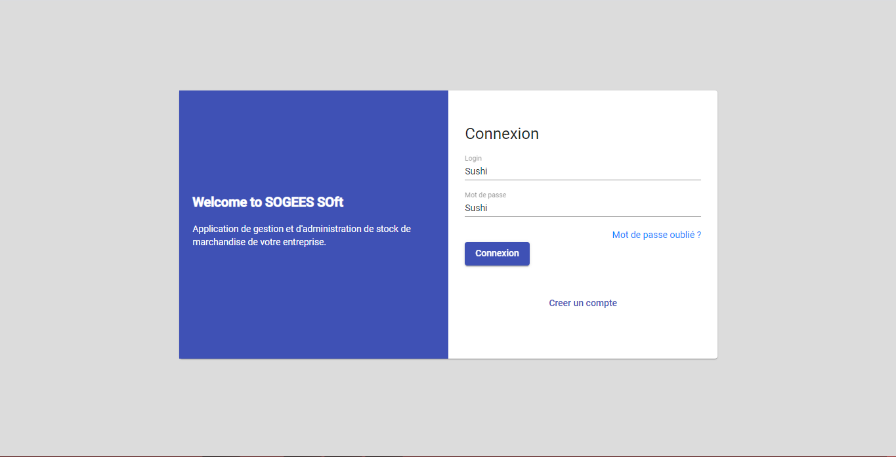

# GestionStock

This project was generated with [Angular CLI](https://github.com/angular/angular-cli) version 9.1.9.

## Development server

Run `ng serve` for a dev server. Navigate to `http://localhost:4200/`. The app will automatically reload if you change any of the source files.

## Code scaffolding

Run `ng generate component component-name` to generate a new component. You can also use `ng generate directive|pipe|service|class|guard|interface|enum|module`.

## Build

Run `ng build` to build the project. The build artifacts will be stored in the `dist/` directory. Use the `--prod` flag for a production build.

To get more help on the Angular CLI use `ng help` or go check out the [Angular CLI README](https://github.com/angular/angular-cli/blob/master/README.md).

# gestion-stock

Sogess soft is a web application to help companies manage their stock of merchandise, to visualize the performance of each store. It is also a decision-making aid.

This part of the software is completely open-source and if you want to contribute to it, just write to me on my facebook account or on my whatsapp account so that I can present you the list of tasks that remain to be done on the font-end side. and backend side.

# Technologies

- Front-end : `Angular`, `Angular-material`, `Bootstrap` 
- Backend : `Nodejs`, `Nestjs`, `MongoDB`

# Quelques interfaces déjà faites

<h2>Interface principale</h2>
*

<h2>Interface de connexion</h2>

<h2>Ajout de produit</h2>

